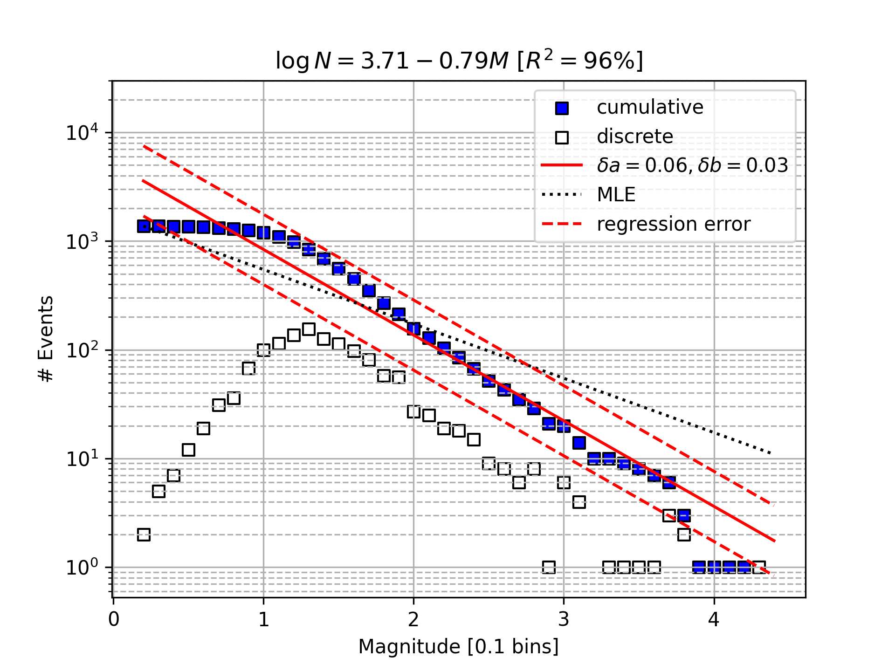
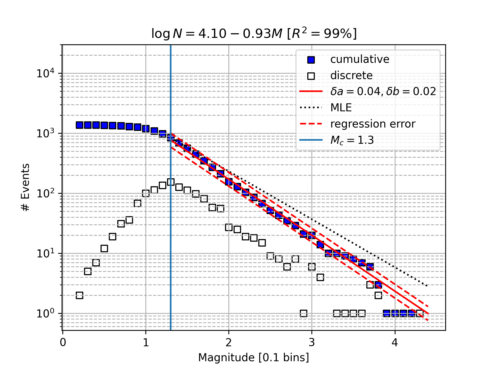
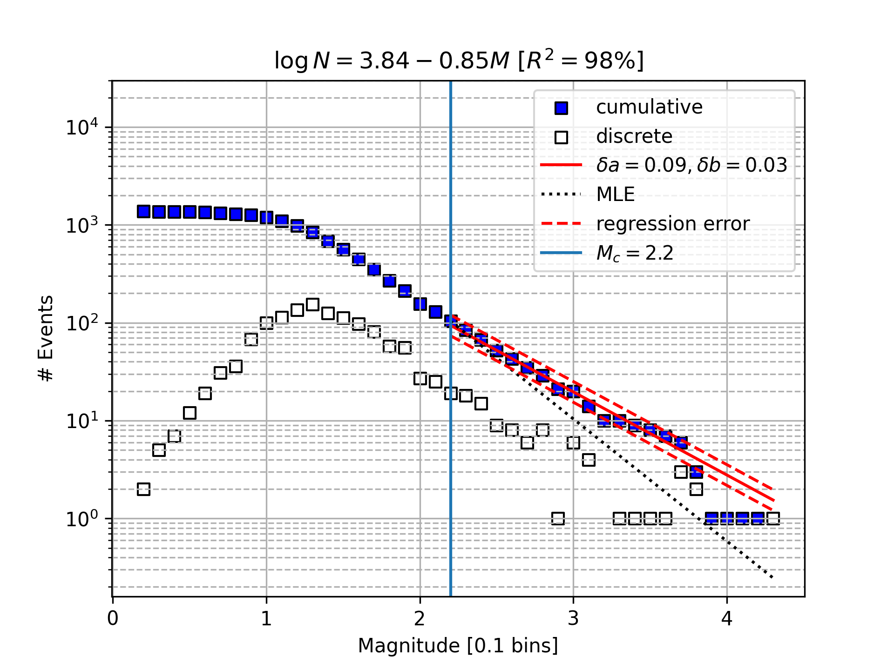
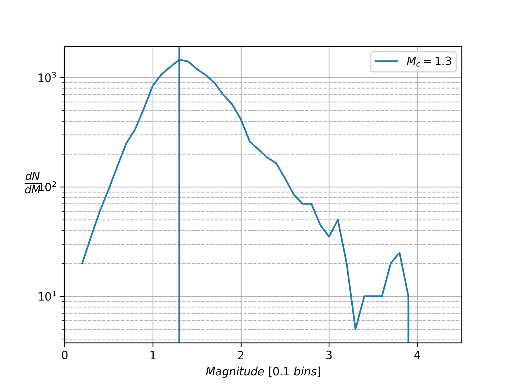

# Estimation-the-GR-law-s-b-and-a-values-through-MLE-and-simple-regression
## Python libraries used:
- Pandas
- Numpy
- statsmodels.formula.api
- matplotlib

## Project description
A python script that reads from the seismic catalogue **NKUA_SL_thiva_sample_catalogue** and estimates the a and b values of the GR-law using MLE and regression techniques. Frequency-Magnitude Distribution diagrams are plotted for visual validation.

## Sample Outputs

